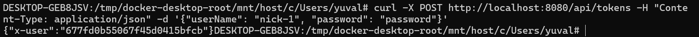
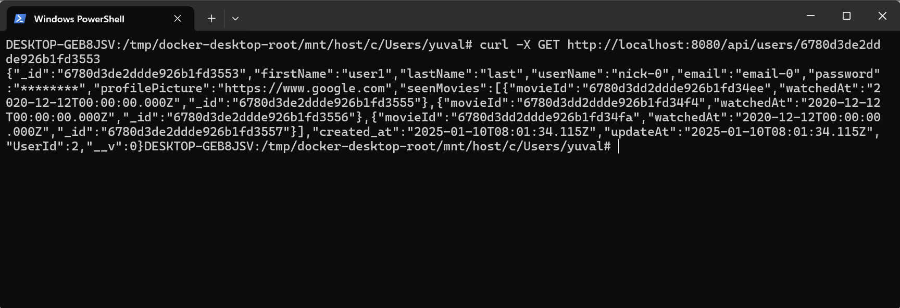
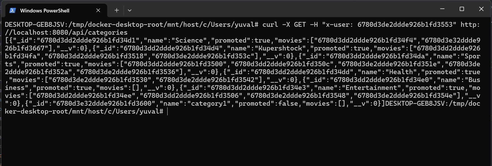
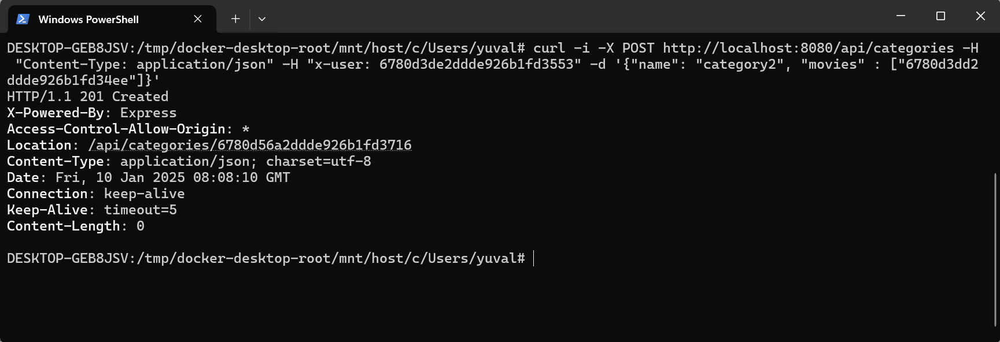
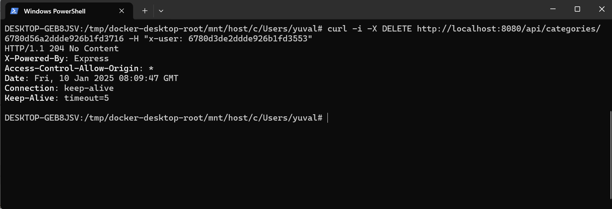
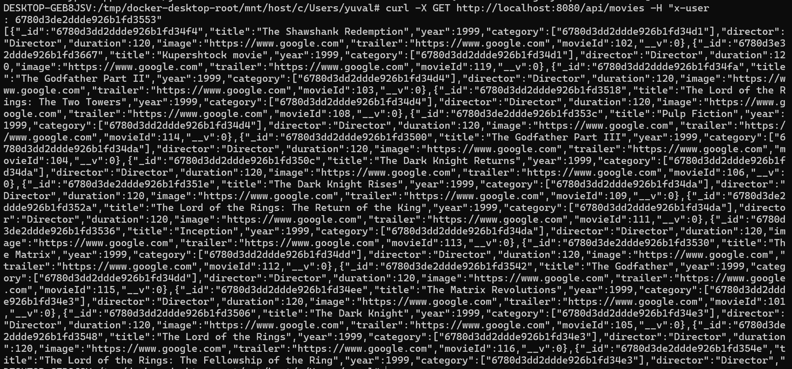
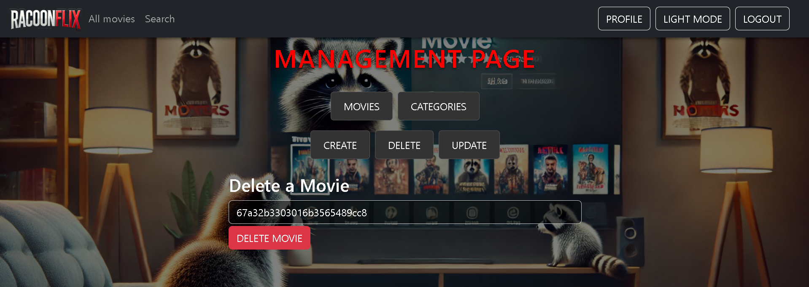
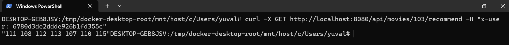

# Netflix
***This project is the best Netflix platform there is on the planet.***


<br>

<hr>

# Table of Contents

- [Netflix](#netflix)
  * [Table of Contents](#table-of-contents)
  * [Build Instructions](#build-instructions)
      + [Build Using docker-compose](#build-using-docker-compose)
      + [Build Using Docker](#build-using-docker)
  * [api usage](#api-usage)
    + [User Management](#user-management)
    + [Authentication](#authentication)
    + [categories](#categories)
    + [movies](#movies)
  * [Examples](#examples)
  * [Author Information](#author-information)

<hr>

# Build Instructions

### <ins> Build using docker-compose</ins>
we provide a ``docker-compose.yml`` file in order to help users build and run the project more easily.

**DON'T FORGET TO PUT THE FOLLOWING FILE INSIDE THE CONFIG FOLDER**
```text
NODE_ENV=local
CONNECTION_STRING=mongodb://<mongo_container_name>:27017/netflix
SERVER_NAME='<recommendSystem_container_name>'
SERVER_PORT='<recommendSystem_port>'
PORT=12345
```
in order to build the netflix client run the following command:
```bash

In order to build and run the netflix web-service just run:

```bash
docker-compose up --build -d
```

when it finished building you can access the api by going to http://localhost:8080
and go to the relevant api which explained in the section [api usage](#api-usage)

**In order to delete everything you did just run** :
```bash
docker-compose down
```

### <ins>Build Using Docker</ins>
we provide 2 Dockerfiles, one for the web-service and one for the recommendation system.

we first need to create a network for the containers to run on using

```bash
docker network create netflix
```
and then we wiil attach each of them to the network

1) <ins>The Netflix recommend system:</ins>  

in order to build the recommend system itself run the following command:
```bash
docker build -f ./RecommendSystem/Dockerfile -t "netflix:1.0.1" ./RecommendSystem
```

now you can run the recommendationSystem and pass also ip and port to listen on (if not provided we will give default one)
```bash
docker run --net="netflix" --rm -v "$(pwd)/RecommendSystem/data/:/usr/src/app/data/" --name "server" -dit netflix:1.0.1 "<ip>" "<port>"
```

<br>

2) <ins> The mongo server </ins>
first create volume that will store the mongo data:
```bash
docker volume create mongo_data
```
in order to create a mongo server just run the following command : 
```bash
docker run --net="netflix" --rm -v "mongo_data:/data/db" -dit --name "mongo" mongo:latest
```

3) <ins>The Netflix web service:</ins>  

**DON'T FORGET TO PUT THE FOLLOWING FILE INSIDE THE CONFIG FOLDER**
.env.local
```text
NODE_ENV=local
CONNECTION_STRING=mongodb://<mongo_container_name>:27017/netflix
SERVER_NAME='<recommendSystem_container_name>'
SERVER_PORT='<recommendSystem_port>'
PORT=12345
```
in order to build the netflix client run the following command:
```bash
docker build -f .\Dockerfile -t "netflix-web-service:1.0.1" .
```

now you can run container like this


**if don't know ip use the servie name which in our case is** : <b>server</b>


```bash
docker run --net="netflix" -p "8080:12345" --name "web-service" -e "NODE_ENV=local" -dit netflix-web-service:1.0.1
```

now just go to [api usage](#api-usage) for more info regarding available commands

<hr>

# api usage

**Just for you to know we also have 2 python files called populateMongo.py which add some dummy data to your mongo database in order for you to see that everything works correctly + file called test_app.py which runs tests on the server based on data inside the mongo to see that the server runs perfectly :)**

## User Management
#### Create a User

Endpoint: 
- ``POST /api/users``  
Description: Creates a new user with the data provided in the request body.

``Response``: 201 created

#### Get User Details

Endpoint: ``GET /api/users/:id``  
Description: Fetches details of a specific user by their id.  

``Response``: info of the user from mongo


## Authentication
#### Login
Endpoint: ``POST /api/tokens``  
Description: Authenticates a user with their credentials and returns a key-value to add to header ("x-user").  

``Response``: {"x-user": "<user-id>"}  

## Categories
#### Get All Categories

Endpoint: ``GET /api/categories``  

Description: Retrieves a list of all categories.
``Response``: all categories objects from mongo

#### Get Specific Category

Endpoint: ``GET /api/categories/:id``  

Description: Retrieves category with this id

``Response``: all category match the id

#### Create a Category

Endpoint: ``POST /api/categories``  

Description: Adds a new category.

``Response``: 201 created


## Movies
#### Get All Movies

Endpoint: ``GET /api/movies``  

Description: Retrieves a list of movies that the user watched (based on his header) and also 20 from each promoted category  

``Response``: the objects from mongo from the seenMovies of the user and also from promoted categories

#### Get Specific Movie

Endpoint: ``GET /api/movies/:id``  

Description: Retrieves data on the movie based on it's mongo id 

``Response``: retrieve the object from mongo that matched this id


#### Replace Movie

Endpoint: ``PUT /api/movies/:id``  

Description: Replace current movie data 

``Response``: response code that shows succeeded

#### Delete Movie

Endpoint: ``DELETE /api/movies/:id``  

Description: Delete movie based on id

``Response``: repsonse code that shows successful deletion


#### Search Movies

Endpoint: ``GET /api/movies/search/:query``  

Description: Searches for movies where a field contains the query.  

``Response``: movies that matches the search criteria


#### Movie Recommendations

Endpoint: ``GET /api/movies/:id/recommend/``  

Description: Fetches recommended movies based on the provided movie ID from recommendation system.

``Response``: movies from recommendation system based on algorithm

#### Add Movie Recommendations

Endpoint: ``POST /api/movies/:id/recommend/``  

Description: add movie to recommendation system to specific user (based on user header)

``Response``: response code shows successful addition


# Examples

<ins>login and get header:</ins>



<ins>get user info</ins>



<ins>create user</ins>


<ins> get categories info </ins>



<ins> create category </ins>



<ins> delete category </ins>



<ins> get movie details </ins>



<ins> delete movie </ins>



<ins> search for movie </ins>


<ins> get movie recommendation </ins>




<hr>
# Author Information

**Yuval Weber**  
**Shay Zingboim**  
**Yair Kupershtock**
<hr>